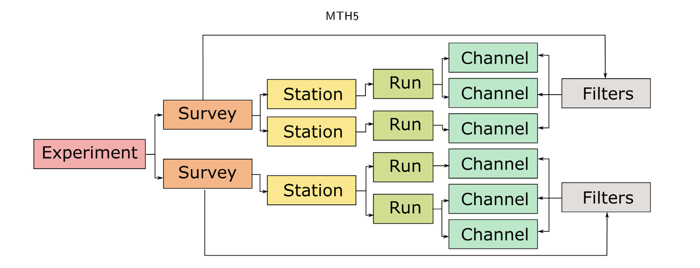

# MTH5 - An archive and exchangeable data format for magnetotelluric time series data

_Jared Peacock, Karl Kappler, Lindsey Heagy, Timothy Ronan, Anna Kelbert, and Andrew Frassetto_

https://doi.org/10.1016/j.cageo.2022.105102



## Summary

Magnetotellurics (MT) is a passive electromagnetic geophysical method that measures variations in subsurface electrical resistivity. MT data are collected in the time domain and processed in the frequency domain to produce estimates of a transfer function representing the Earth’s electrical structure. Unfortunately, the MT community lacks metadata and data standards for time series data. As the community grows and findability, accessibility, interoperability, and reuse of digital assets (FAIR) data principles are enforced by government and funding agencies, a standard is needed for time series data. Presented here is a hierarchical data format (MTH5) that is logically formatted to how MT data are collected. Open-source Python packages are also described to read, write, and manipulate MTH5 files. These include a package to deal with metadata (mt_metadata) based on standards developed by the Working Group for Magnetotelluric Data Handling and Software assembled by the Incorporated Research Institutions for Seismology (IRIS), and mth5: a package to interact with MTH5 files that uses mt_metadata. Example code and workflows are presented.

## Citation

Peacock, J., Kappler, K., Heagy, L., Ronan, T., Kelbert, A., & Frassetto, A. (2022). MTH5: An archive and exchangeable data format for magnetotelluric time series data. Computers & Geosciences, 162, 105102. https://doi.org/10.1016/j.cageo.2022.105102

```
@article{peacock_series_2022,
title = {MTH5: An archive and exchangeable data format for magnetotelluric time series data},
journal = {Computers & Geosciences},
volume = {162},
pages = {105102},
year = {2022},
issn = {0098-3004},
doi = {https://doi.org/10.1016/j.cageo.2022.105102},
url = {https://www.sciencedirect.com/science/article/pii/S0098300422000632},
author = {Jared Peacock and Karl Kappler and Lindsey Heagy and Timothy Ronan and Anna Kelbert and Andrew Frassetto}
}
```
